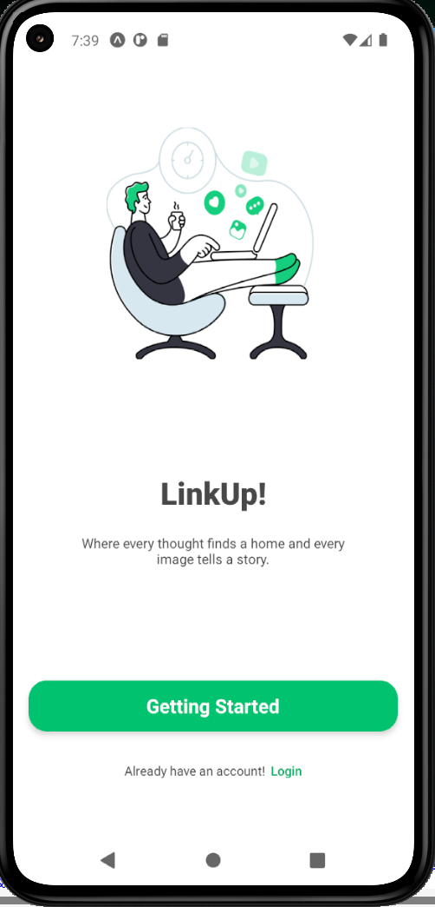
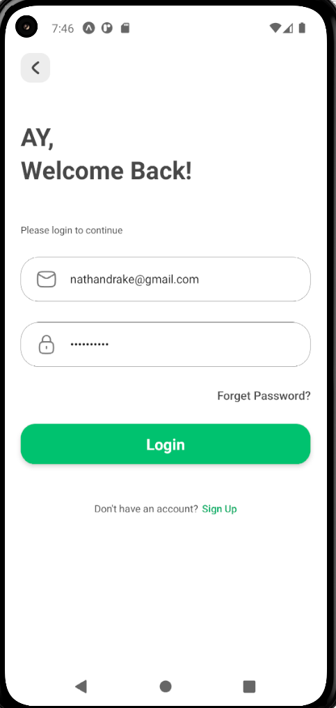
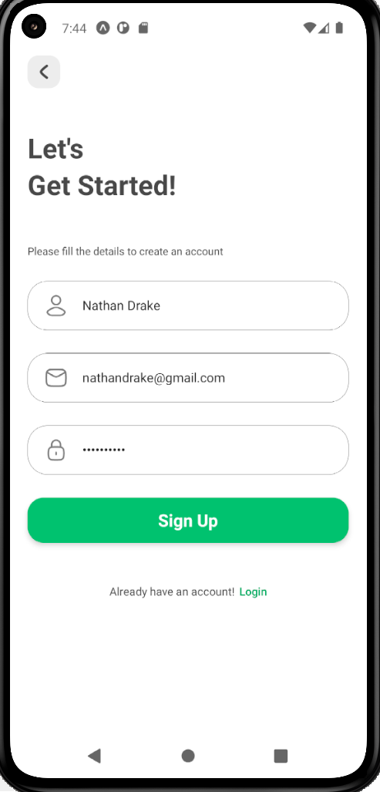
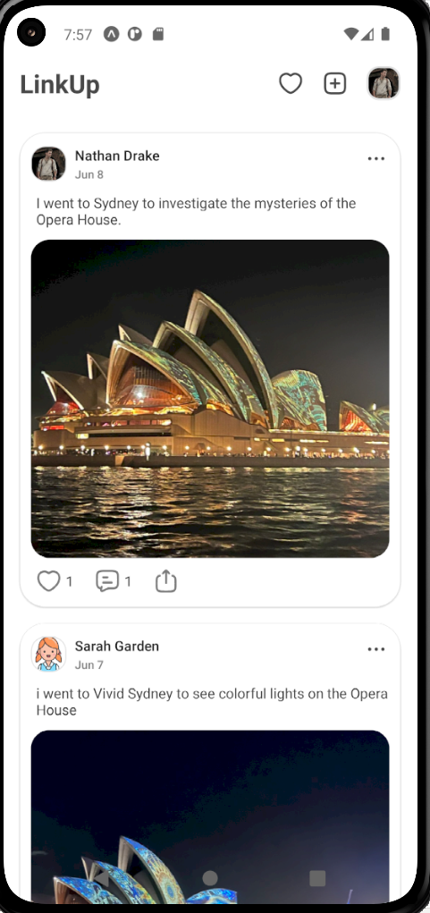
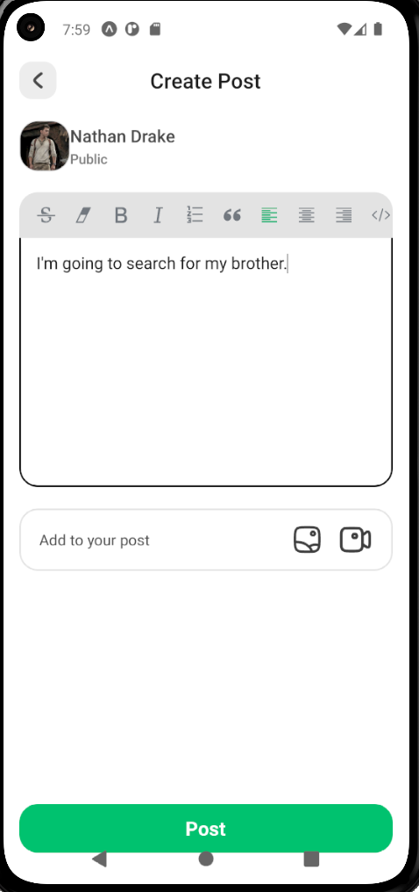
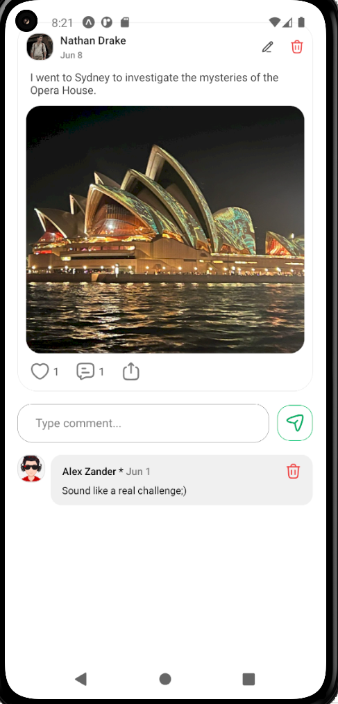
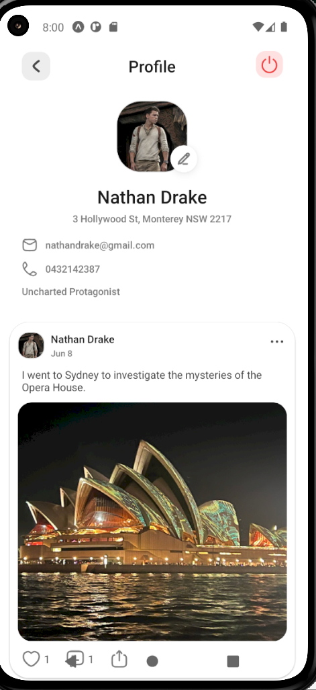
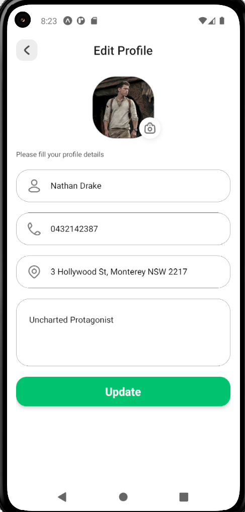
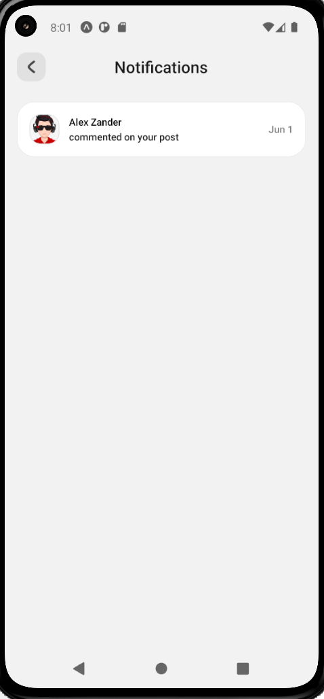

# 💬 Social Media Chat Mobile App

A full-stack social media mobile app built with React Native and Expo, 
powered by Supabase as the backend. Users can sign up, create posts, 
like and comment on posts, update their profile, and receive real-time 
notifications — all from their mobile device.

---

## 📸 Screenshots

| Welcome | Login | Sign Up |
|---|---|---|
|  |  |  |

| Home Feed | Create Post | Post Details |
|---|---|---|
|  |  |  |

| Profile | Edit Profile | Notifications |
|---|---|---|
|  |  |  |

---

## 📱 Features

- 🔐 Authentication — Sign up, log in, and log out securely via Supabase Auth
- 👤 User Profiles — View and edit profile (name, bio, address, phone, avatar)
- 📝 Create Posts — Rich text editor with image and video attachment support
- ❤️ Like Posts — Like and unlike posts in real time
- 💬 Comments — Comment on posts and view post details
- 🔔 Notifications — Receive real-time notifications on likes and comments
- 📄 Pagination — Smooth infinite scrolling through the post feed
- 🔄 Real-time Updates — Live feed updates powered by Supabase Realtime
- 🖼️ Media Uploads — Upload images and videos to Supabase Storage
- ✏️ Edit & Delete — Update or remove your own posts and profile

---

## 🛠️ Tech Stack

| Layer | Technology |
|---|---|
| Framework | React Native + Expo (SDK 54) |
| Routing | Expo Router (file-based) |
| Backend & Database | Supabase (PostgreSQL) |
| Authentication | Supabase Auth |
| File Storage | Supabase Storage |
| Rich Text Editor | react-native-pell-rich-editor |
| Image Picker | expo-image-picker |
| File System | expo-file-system |
| Media Playback | expo-av |
| Icons | Hugeicons (react-native-svg) |
| Date Formatting | moment.js |
| HTML Rendering | react-native-render-html |

---

## 🗄️ Database Schema

| Table | Fields |
|---|---|
| **users** | id, name, image, bio, address, phoneNumber, createdAt |
| **posts** | id, body, file, userId, createdAt |
| **postLikes** | id, postId, userId, createdAt |
| **comments** | id, text, userId, postId, createdAt |
| **notifications** | id, title, senderId, receiverId, data, createdAt |

---

## 🚀 Getting Started

### Prerequisites
- Node.js installed
- Expo Go app on your phone or an Android/iOS emulator

### Installation

1. Clone the repo
```bash
git clone https://github.com/Pro-Max-Park/social-media-chat-mobile-app.git
```

2. Navigate into the project folder
```bash
cd social-media-chat-mobile-app
```

3. Install dependencies
```bash
npm install
```

4. Start the app
```bash
npx expo start
```

5. Scan the QR code with **Expo Go** (Android) or **Camera app** (iOS)

---

## 🔧 Environment Setup

Create a `.env` file in the root of your project and add your Supabase credentials:

---

## 🐛 Bugs Fixed During Development

| Bug | Solution |
|---|---|
| Keyboard not dismissing in rich text editor | Used `blurContentEditor()` + `keyboardShouldPersistTaps="handled"` on ScrollView |
| Supabase realtime subscription error on logout | Changed hardcoded `.channel("posts")` to `.channel(`posts-${Date.now()}`)` for a unique channel name on every mount |

---

## 🔮 Future Improvements

- [ ] Direct messaging between users
- [ ] Story / 24hr post feature
- [ ] Dark mode support
- [ ] Push notifications via Expo Notifications
- [ ] Deploy to Google Play Store & Apple App Store

---

## 👨‍💻 Author

**Peter Park**
GitHub: [@Pro-Max-Park](https://github.com/Pro-Max-Park)

---

## 📄 License

This project is open source and available under the [MIT License](LICENSE).
